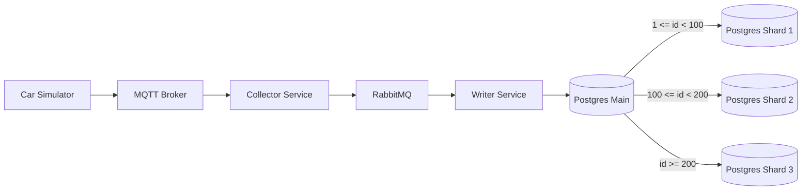

# Postgres sharding example

## Overview

This is an example of how to set up Postgres sharding with foreign partitions. I wanted to learn sharding and used an existing repo that emits some data already.

## Running the services

Every service required to complete the assignment is defined in the `docker-compose.yml` file. To run it simply execute:

```sh
docker-compose up -d
```

This will start:

- Main Postgres on local port `55432` (`postgres-main`)
- Shard Postgres instances on local ports `55433`, `55434`, `55435` (`postgres-shard-1/2/3`)
- Mosquitto MQTT broker on port `51883`
- RabbitMQ on port `55672`
- The helper script which initializes the database tables and starts the electrical car simulation

All important credentials for connecting to the services can be seen in the `docker-compose.yml` file itself.

After the services are up, run the app services in two terminals:

```sh
npm run collector
```

```sh
npm run writer
```


## Data description

The data coming from MQTT include these important topics:

- `car/[carId]/location/latitude` - latitude component of current car's position
- `car/[carId]/location/longitude` - longitude component of current car's position
- `car/[carId]/speed` - current speed of the car in m/s
- `car/[carId]/gear` - the gear the car is currently in (values N,1,2,3,4,5,6)
- `car/[carId]/battery/[batteryIndex]/soc` - state of charge of given battery in the car as a percentage from 0-100
- `car/[carId]/battery/[batteryIndex]/capacity` - capacity of given battery in the car in Wh

The database contains a table called `vehicle_state` with these columns:

```
id              serial primary key,
car_id          integer,
time            timestamp,
state_of_charge integer,
latitude        double precision,
longitude       double precision,
gear            integer,
speed           double precision
```

## How it works

The collector reads data from the MQTT broker and publishes normalized messages into a RabbitMQ queue. In practice the incoming topics are not perfectly in sync: gear changes arrive only on change, speed can be delayed, and battery info can be missing or arrive for just one battery. The collector accounts for this so the resulting time series does not have missing time points.

The writer consumes the RabbitMQ queue and inserts rows into the database table.

The resulting table contains one row per **5 second** interval for each timestamp. In the stored data, gear is an integer with values (0-6, where N=0), speed is in km/h, and there is only one state of charge. That overall state of charge is a weighted average of the per-battery state of charge, weighted by each battery's capacity.

The system is modeled for a single car with id `1`. It has two batteries, and their capacities are treated as constant once read from MQTT (you can store them in code as constants).

## Sharding

Sharding is implemented via Postgres range partitioning on the main database using `id` as the partition key. In practice ID is NOT a good choice for sharding key. I would rather pick car ID as a sharding key so that it is distributed evenly across shards. But for this example, the data is generated as a black box, so I will use `id` as it seems to be the easiest to demonstrate the sharding concept.

The main database defines the parent table `vehicle_state` and attaches three **foreign table** partitions that point to the shard databases. Each shard stores the physical rows for its range, while inserts go through the main database, which routes rows to the correct shard based on `id`.

Partition key and ranges:

- Key: `id`
- Range 1: `1 <= id < 100` (shard 1)
- Range 2: `100 <= id < 200` (shard 2)
- Range 3: `id >= 200` (shard 3)

How to verify routing:

1. Insert via the main database (port `55432`):
```sql
INSERT INTO vehicle_state (car_id, time, state_of_charge, latitude, longitude, gear, speed)
VALUES (1, now(), 50, 1.1, 2.2, 1, 10);
```

2. Check which partition was used from the main DB:
```sql
SELECT tableoid::regclass AS partition, count(*)
FROM vehicle_state
GROUP BY 1;
```

3. Connect to a shard (ports `55433`/`55434`/`55435`) and confirm the row count:
```sql
SELECT count(*) FROM vehicle_state;
```

## Diagram


